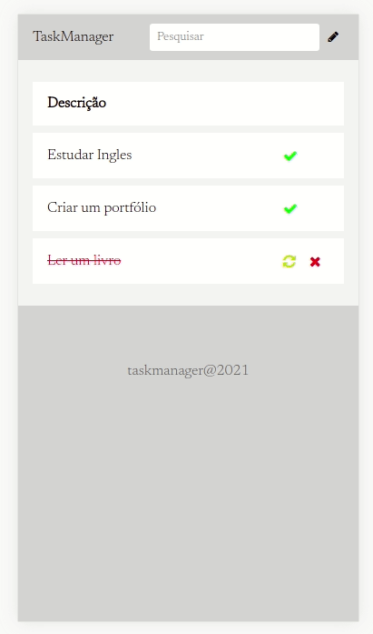

# TaskManager

Application for task management built with react, node and mongo.

## About the Project



## Built With

```
NodeJS
```
```
MongoDB
```
```
ReactJS
```
```
Css
```
```
Html
```

## Prerequisites

* [React](https://reactjs.org/)

* [NodeJS](https://nodejs.org/en/download/)

* [MongoDB](https://www.mongodb.com/)

### Installing

Clone the repo

```
https://github.com/matheusleal-code/-task_manager.git
```

Running backend and open mongo

```
    cd Desktop/-task_manager/api
    npm install
    npm run dev
    mongod
    mongo
```

Running frontend

```
    cd -task_manager
    npm install
    npm start
```

Open localhost on port 3000

## Built With

* [React](https://reactjs.org/) - The web frontend used
* [Nodejs](https://nodejs.org/en/download/) - The web backend javascript 
* [MongoDB](https://www.mongodb.com/) - The database used

## Authors

* **Matheus Leal**